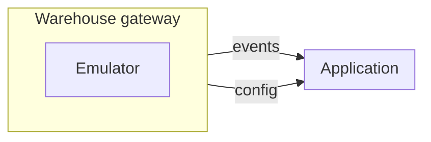

# Warehouse monitoring backend

Этот проект является бэкендом приложения для
мониторинга автоматизированного склада

Приложение позволяет взаимодействовать с ним через
REST API и, местами через WebSocket. (там, где
нужно отображать происходящее в реальном времени)

Чтобы облегчить переход на реальный склад вместо
эмулируемого, было принято решение скрыть подробности
реализации класса за интерфейсом warehouse gateway.

Этот интерфейс даёт возможность пробросить внутрь
системы управляющей складом наблюдатель, в котором
зарегистрированы все нужные функции обратного
вызова. Так-же, у приложения есть возможность
получить сводную информацию о состоянии складов.
Подробнее смотрите `infractructure/warehouse/gateway`.

Всё что относится непосредственно к мониторингу
находится здесь в директории `domain`.

Было решено, что приоритет нужно брать на проработку
объектов в предметной модели, потому-что дальнейшая 
возможность аналитики данных будет напрямую зависеть
от того, правильно ли программа эти данные представляет.
Поэтому код написан близко к принципам методологии DDD.

В ходе развития проекта необходимо выявить узкие места в
производительности и оптимизировать их.

Чтобы запустить проект для разработки, достаточно прописать
команду `pip install -e .` в директории проекта. Всё остальное
происходящее в Dockerfile нужно чтобы пересборка образа
не требовала каждый раз повторной установки модулей.
